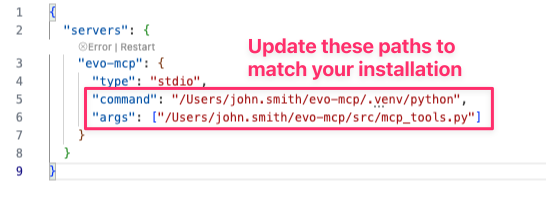

<p align="center"><a href="https://seequent.com" target="_blank"><picture><source media="(prefers-color-scheme: dark)" srcset="https://developer.seequent.com/img/seequent-logo-dark.svg" alt="Seequent logo" width="400" /></picture></a></p>

<p align="center">
    <a href="https://developer.seequent.com/" target="_blank">Seequent Developer Portal</a>
    &bull; <a href="https://community.seequent.com/group/19-evo" target="_blank">Seequent Community</a>
    &bull; <a href="https://seequent.com" target="_blank">Seequent website</a>
</p>

# Evo MCP 

## Table of contents

- [What is MCP?](#what-is-mcp)
- [What is the Evo MCP server?](#what-is-the-evo-mcp-server)
- [Use Cases](#use-cases)
- [Evo MCP server architecture](#evo-mcp-server-architecture)
- [Getting Started](#getting-started)
  - [Prerequisites](#prerequisites)
  - [Installation](#installation)
- [Connect to Evo MCP](#connect-to-evo-mcp)
  - [VS Code](#vs-code)
  - [Cursor](#cursor)
- [Using Evo MCP](#using-evo-mcp)
- [Advanced](#advanced)
  - [Testing Evo MCP with a Google ADK agent](#testing-evo-mcp-with-a-google-adk-agent)
- [Development](#development)
- [Contributing](#contributing)
- [Code of conduct](#code-of-conduct)
- [License](#license)
- [Disclaimer](#disclaimer)
- [Acknowledgements](#acknowledgements)

## What is MCP?

> The Model Context Protocol (MCP) is an open protocol that enables seamless integration between LLM applications and external data sources and tools. Whether you're building an AI-powered IDE, enhancing a chat interface, or creating custom AI workflows, MCP provides a standardized way to connect LLMs with the context they need.
>
> — [Model Context Protocol README](https://github.com/modelcontextprotocol)

An MCP Server is a lightweight program that provides specific features through the Model Context Protocol standard. Applications like chatbots, code editors, and AI tools run MCP clients that each establish a direct connection with an MCP server. Popular MCP clients include agentic code assistants (such as [VS Code](https://code.visualstudio.com) and [Cursor](https://cursor.com)) and conversational tools like Claude Desktop, with more expected in the future. MCP servers can connect to both local and remote data, supplying enriched information that enables AI models to generate more accurate and useful results.

MCP servers are consumable by any MCP client such as VS Code, Claude Desktop, or a Google ADK agent.

## What is the Evo MCP server?

The Evo MCP server is a self-hosted server that provides a secure, standardised interface between your AI tools and the Evo platform. It acts as a bridge, exposing Evo SDK functionality - like access to your workspaces, geoscience objects, and block models - to any AI model or agent you choose.

The server comes packaged with many tools written by Seequent, but it is fully extensible and users are encouraged to add their own tools.

## Use Cases

* Workspace Management: Create workspaces, summarize objects, snapshot and duplicate workspaces, copy objects between workspaces.
* Geoscience Object Creation: structured geoscience objects (Pointsets, Line Segments, Downhole Collections, and Downhole Intervals) in Evo directly from raw CSV files, automating data validation and schema mapping.

> [!WARNING]
> The Evo MCP server is in early development. Functionality is currently limited. Your feedback on future development is welcome!

## Evo MCP server architecture

MCP Client (VS Code / ADK Agent / etc) <-> MCP Server (FastMCP + Evo SDK) <-> Evo APIs

## Getting started

### Prerequisites
- Python 3.10+
- Access to Seequent Evo (https://evo.seequent.com)

### Installation 

**1. Clone this repository**
```powershell
git clone https://github.com/SeequentEvo/evo-mcp.git
```

**2. Navigate to the root directory**
```powershell
cd <path-to-this-repository>
```

**3. Create a Python environment**

<strong>Option 1: Using `uv` (recommended)</strong>

The Python package manager `uv` makes it easy to set up your Python environment. Visit the [uv website](https://docs.astral.sh/uv/) to learn more.

#### a. Install `uv` (if not already installed)

##### Windows

```powershell
powershell -ExecutionPolicy ByPass -c "irm https://astral.sh/uv/install.ps1 | iex"
```

##### macOS and Linux

```bash
curl -LsSf https://astral.sh/uv/install.sh | sh
```

#### b. Create the Python environment including dependencies
```bash
uv sync
```

<strong>Option 2: Using `pip` and `pyenv`</strong>

If you prefer using `pip` and `pyenv` to manage your Python environment:

#### a. Install `pyenv` (if not already installed)
   - **Windows**: Use [pyenv-win](https://github.com/pyenv-win/pyenv-win#installation)
   - **macOS**: `brew install pyenv`
   - **Linux**: Follow [pyenv installation guide](https://github.com/pyenv/pyenv#installation)


#### b. Install Python 3.10+
   ```bash
   pyenv install 3.10
   pyenv local 3.10
   ```

#### c. Create a virtual environment

```bash
python -m venv .venv
```

#### d. Activate the virtual environment

##### Windows
```powershell
.venv\Scripts\activate
```

##### macOS and Linux

```bash
source .venv/bin/activate
```

#### e. Install dependencies

```bash
pip install -r requirements.txt
```

### 6. Configure your Evo credentials

You need to create a **native app** in the iTwin Developer Portal before continuing. Visit the [Evo Developer Portal](https://developer.seequent.com/docs/guides/getting-started/apps-and-tokens) to learn how to create an app.

Copy the file `.env.example`, rename the copy to `.env` and fill in:
```bash
EVO_CLIENT_ID=your-client-id
EVO_REDIRECT_URL=your-redirect-url

# Server configuration (optional)
MCP_TOOL_FILTER=all
```

### 7. Configure MCP tool filtering (optional)

Set `MCP_TOOL_FILTER` environment variable in `.env` to filter available tools:
- `admin` - Workspace/instance management and bulk data operations
- `data` - Object import, download and query operations  
- `all` - All tools (default)

## Connect to Evo MCP

Apps like VS Code and Cursor make it easy to connect to MCP servers, whether they are running locally or are available over a network or the internet. VS Code is free to download and use but Cursor requires a paid subscription.

### VS Code

#### Installation

VS Code comes in two flavours - **VS Code** and **VS Code Insiders**. Install one of these apps before running Evo MCP. NOTE: Both of these apps can be installed and used independently.

- Install the regular version of [VS Code](https://code.visualstudio.com/Download).
- Install [VS Code Insiders](https://code.visualstudio.com/insiders/) for the most up-to-date experience. **VS Code Insiders** provides early access to the latest features and improvements for MCP integration, ensuring optimal compatibility and performance. 

#### Configuration

MCP server configurations can be added to VS Code in one of two places:
- **User settings**. The MCP server will be accessible everywhere (recommended).
- **Workspace settings**. The MCP server can only be accessed in designated VS Code workspaces.

Run the supplied Python script to add the required settings. The script will ask if you want to modify the **user settings** or the **workspace settings**.

**If you set up Python with `uv`:**
```bash
uv run python scripts/setup-vscode.py
```

**If you set up Python with `pip`:**
```bash
python scripts/setup-vscode.py
```

**Manual method**
1. Copy the settings found in `templates/vscode-mcp-config.json`.
2. Open the **Command Palette** (press `Cmd+Shift+P` on macOS / `Ctrl+Shift+P` on Windows/Linux).
3. Search for "mcp". Select either **MCP: Open User Configuration** to update the user settings or **MCP: Open Workspace Folder MCP Configuration** to update the workspace settings.
  
4. Paste the settings you copied from the template and update the paths to match your installation. Save the file.
  
5. When prompted by the app, enter agent type: `admin`, `data`, or `all`.
6. The MCP server will start automatically when accessed by Copilot.

#### Verify the configuration

To verify that the Evo MCP server is correctly configured in VS Code:

1. Click the **Extensions** button in the Activity Bar (or press `Cmd+Shift+X` on macOS / `Ctrl+Shift+X` on Windows/Linux).

    

2. Look for **evo-mcp** in the list of **MCP Servers - Installed**.
  
3. Ensure there are no warning icons or error messages displayed.

If you see **evo-mcp** listed without any warnings, the configuration is correct and the server is ready to use.

### Cursor

#### Installation

Cursor is an AI-powered code editor with built-in support for MCP servers. To use the Evo MCP server in Cursor, you must first [download and install it](https://cursor.com/download). Note that Cursor requires a paid subscription to use MCP features.

#### Configuration

MCP server configurations can be added to Cursor in one of two places:
- **User settings**. The MCP server will be accessible everywhere (recommended).
- **Workspace settings**. The MCP server can only be accessed in designated Cursor workspaces.

Run the supplied Python script to add the required settings. The script will ask if you want to modify the **user settings** or the **workspace settings**.

**If you set up Python with `uv`:**
```bash
uv run python scripts/setup-cursor.py
```

**If you set up Python with `pip`:**
```bash
python scripts/setup-cursor.py
```

#### Manual method (user settings)
1. Copy the settings found in `templates/cursor-mcp-config.json`.
2. Open the **Command Palette** (press `Cmd+Shift+P` on macOS / `Ctrl+Shift+P` on Windows/Linux).
3. Search for "mcp". Select either **View: Open MCP Settings** to update the user settings.
  

4. Click the **Add Custom MCP** button.

    

5. Paste the settings you copied from the template and update the paths to match your installation. Save the file.
  
6. When prompted, enter agent type: `admin`, `data`, or `all`.
7. The MCP server will start automatically when accessed by Cursor AI.

#### Manual method (workspace settings)
1. Copy the settings found in `templates/cursor-mcp-config.json`.
2. Create a new folder in your workspace called **.cache** (be sure to include the period character). 
3. Create a new file within this folder called **mcp.json**.
4. Open **mcp.json**, paste the settings you copied from the template and update the paths to match your installation. Save the file.
  

5. When prompted, enter agent type: `admin`, `data`, or `all`
6. The MCP server will start automatically when accessed by Cursor AI

#### Verifying the integration

To verify that the Evo MCP server is correctly configured in Cursor:

1. Open **Settings > Cursor Settings**.
2. In the search bar, type **Tools & MCP**.
3. Look for **evo-mcp** in the **Installed MCP Servers** list. The MCP server should be enabled, display with a green light and list the properties of the server, eg. number of tools, etc.
  


## Using Evo MCP

Tips for getting the best experience:
- **Use a separate workspace**: Open a fresh VS Code or Cursor workspace just for connecting to the Evo MCP server (not the **evo-mcp** repo). GitHub Copilot may decide to bypass using MCP if it can see the MCP code directly in the workspace.
- **Let VS Code/Cursor start the MCP server on demand**: You don't need to launch the Python script manually.
- **Check your .env**: Ensure `EVO_CLIENT_ID` and `EVO_REDIRECT_URL` are set in your `.env` file before connecting.
- **Reload after changes**: If you edit settings or `.env` values, reload the window so the client picks up the new config.

---

## Advanced

### Testing Evo MCP with a Google ADK agent

An example Google ADK agent is provided for testing the MCP server:

**Prerequisites:**
- Google Cloud SDK (`gcloud` CLI) installed and configured

  ```powershell
  gcloud auth application-default login
  ```

- A GCP project with Vertex AI API enabled

  **Add to `.env`:**

    ```bash
    GOOGLE_CLOUD_PROJECT=your-project-id
    GOOGLE_CLOUD_LOCATION=your-region

    # Passed through to the MCP server's `MCP_TOOL_FILTER` config.
    EVO_AGENT_TYPE=all
    ```

**Run:**
  ```powershell
  cd src\agents
  adk web
  ```

Browse to http://localhost:8000 to interact with the agent.

## Development

To add new MCP tools:
1. Add tool function to appropriate module in `src/evo_mcp/tools/`
2. Decorate with `@mcp.tool()` decorator
3. Tools are auto-registered based on their module (general/admin/data) on server startup
4. Test using VS Code integration or the ADK agent

## Contributing

Thank you for your interest in contributing to Seequent software. Please have a look over our [contribution guide.](./CONTRIBUTING.md)

## Code of conduct

We rely on an open, friendly, inclusive environment. To help us ensure this remains possible, please familiarise yourself with our [code of conduct](./CODE_OF_CONDUCT.md).

## License

The Evo MCP server is open source and licensed under the [Apache 2.0 license.](./LICENSE.md).

Copyright © 2026 Bentley Systems, Incorporated.

Licensed under the Apache License, Version 2.0 (the "License").
You may obtain a copy of the License at

    http://www.apache.org/licenses/LICENSE-2.0

Unless required by applicable law or agreed to in writing, software
distributed under the License is distributed on an "AS IS" BASIS,
WITHOUT WARRANTIES OR CONDITIONS OF ANY KIND, either express or implied.
See the License for the specific language governing permissions and
limitations under the License.

## Disclaimer

Before using an MCP Server, you should consider conducting your own independent assessment to ensure that your use would comply with your own specific security and quality control practices and standards, as well as the laws, rules, and regulations that govern you and your content.

## Acknowledgements

Much of this document was inspired by the excellent guide written by [AWS Labs](https://github.com/awslabs/mcp).
